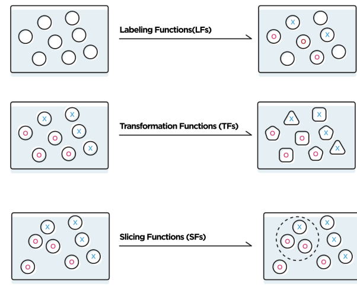

## Programmatically Building & Managing Training Data with Snorkel

Snorkel is a system for _programmatically_ building and managing training datasets **without needing to hand-label _any_ training data**.
In Snorkel, users can develop training datasets in hours or days rather than hand-labeling them over weeks or months.

Snorkel currently exposes three key programmatic operations: **labeling data**, for example using heuristic rules or distant supervision techniques; **transforming data**, for example rotating or stretching images to perform data augmentation; and **slicing data** into different critical subsets.
Snorkel then automatically models, cleans, and integrates the resulting training data using novel, theoretically-grounded techniques.



In this quick walkthrough, we'll preview the high level workflow and interfaces of Snorkel using a canonical machine learning problem: classifying spam.
We'll use a public [YouTube comments dataset](https://www.kaggle.com/goneee/youtube-spam-classifiedcomments) from Kaggle, and see how **Snorkel can enable you to train a machine learning model without _any_ hand-labeled training data!**
For the more detailed version, see the [Introductory Tutorial](#).

We'll walk through five basic steps:

1. **Writing Labeling Functions (LFs):** First, rather than hand-labeling any training data, we'll programamtically label our _unlabeled_ dataset with LFs
2. **Modeling & Combining LFs:** Next, we'll use the `LabelModel` to automatically learn the accuracies of our LFs and reweight and combine their outputs
3. **Writing Transformation Functions (TFs) for Data Augmentation:** Then, we'll augment this labeled training set by writing a simple TF
4. **Writing _Slicing Functions (SFs)_ for Data Subset Selection:** Then, we'll write an SF to identify a critical subset or _slice_ of our training set.
5. **Training a final ML model:** Finally, we'll train a simple ML model with our training set!

We'll start first by loading the _unlabeled_ comments, which we'll use as our training data, as a pandas `DataFrame`:


```python
from utils import load_unlabeled_spam_dataset
df_train = load_unlabeled_spam_dataset()
```

## (1) Writing Labeling Functions

_Labeling functions (LFs)_ are one of the core operators for building and managing training datasets programmatically in Snorkel.
The basic idea is simple: **a labeling function is a function that labels some subset of the training dataset**.
That is, in our example here, each labeling function takes as input a comment object, and either outputs a label (`SPAM = 1` or `NOT_SPAM = 0`) or abstains from labeling (`ABSTAIN = -1`):


```python
# Define the label mappings for convenience
ABSTAIN = -1
NOT_SPAM = 0
SPAM = 1
```

Labeling functions can be used to represent many heuristic and/or noisy strategies for labeling data, often referred to as [weak supervision](#).
The basic idea of labeling functions, and other programmatic operators in Snorkel, is to let users inject domain information into machine learning models in higher level, higher bandwidth ways than manually specifying single-bit labels for individual data points.
**The key idea is that labeling functions do not need to be perfectly accurate**, and can in fact even be  correlated with each other, as Snorkel will automatically estimate their accuracies and correlations in a [provably consistent way](https://papers.nips.cc/paper/6523-data-programming-creating-large-training-sets-quickly), and then reweight and combine their output labels, leading to high-quality training labels.

In our text data setting here, labeling functions can be keyword matchers:


```python
from snorkel.labeling import labeling_function

@labeling_function()
def lf_keyword_my(x):
    """Many spam comments talk about 'my channel', 'my video', etc."""
    return SPAM if "my" in x.text.lower() else ABSTAIN
```

Use regular expressions:


```python
import re

@labeling_function()
def lf_regex_check_out(x):
    """Spam comments say 'check out my video', 'check it out', etc."""
    return SPAM if re.search(r"check.*out", x.text, flags=re.I) else ABSTAIN
```

Flexibly leverage arbitrary heuristics:


```python
@labeling_function()
def lf_short_comment(x):
    """Ham comments are often short, such as 'cool video!'"""
    return NOT_SPAM if len(x.text.split()) < 5 else ABSTAIN
```

Use third-party models:


```python
from textblob import TextBlob

@labeling_function()
def lf_textblob_polarity(x):
    """
    We use a third-party sentiment classification model, TextBlob,
    combined with the heuristic that ham comments are often positive.
    """
    sentiment = TextBlob(x.text).sentiment
    return NOT_SPAM if sentiment.polarity > 0.3 else ABSTAIN
```

And much more!
For many more types of labeling functions---including over data modalities beyond text---see the other [tutorials](#) and [real-world examples](#).

In general the process of developing labeling functions is, like any other development process, an iterative one that takes time- but that, in many cases, can be orders-of-magnitude faster that hand-labeling training data.
For more detail on the process of developing labeling functions and other training data operators in Snorkel, see the [Introductory tutorial](#).

## (2) Combining & Cleaning the Labels

Our next step is to apply the labeling functions we wrote to the unlabeled training data.
The result is a _label matrix_, `L_train`, where each row corresponds to a data point and each column corresponds to a labeling function.
Since the labeling functions have unknown accuracies and correlations, their output labels may overlap and conflict; we use the `LabelModel` to automatically estimate their accuracies and correlations, reweight and combine their labels, and produce our final set of clean, integrated training labels:


```python
from snorkel.labeling import PandasLFApplier, LabelModel

# Define the set of labeling functions (LFs)
lfs = [
    lf_keyword_my,
    lf_regex_check_out,
    lf_short_comment,
    lf_textblob_polarity
]

# Apply the LFs to the unlabeled training data
applier = PandasLFApplier(lfs)
L_train = applier.apply(df_train)

# Train the label model and compute the training labels
label_model = LabelModel(cardinality=2, verbose=True)
label_model.fit(L_train, n_epochs=500, log_freq=50, seed=123)
df_train['label'] = label_model.predict(L=L_train)
```

Note that we used the `LabelModel` to label data; however, on many data points, all the labeling functions abstain, and so the `LabelModel` abstains as well.
We'll filter these examples out of our training set now:


```python
# TODO: Filter out abstains
```

Our ultimate goal is to use the resulting labeled training data points to train a machine learning model that can **generalize beyond the coverage of the labeling functions and the `LabelModel`**.
However first we'll explore some of Snorkel's other operators for building and managing training data.

## (3): Writing Transformation Functions for Data Augmentation

An increasingly popular and critical technique in modern machine learning is [data augmentation](#), the strategy of artificially _augmenting_ existing labeled training datasets by creating transformed copies of the data points.
Data augmentation is a practical and powerful method for injecting information about domain invariances into ML models via the data, rather than by trying to modify their internal architectures.
The canonical example is randomly rotating, stretching, and transforming images when training image classifiers---a ubiquitous technique in the field of computer vision today.
However, data augmentation is increasingly used in a range of settings, including text.

Here, we implement a simple text data augmentation strategy- randomly replacing a word with a synonym.
We express this as a *transformation function (TF)*:


```python
from snorkel.augmentation import transformation_function
import random
import nltk
from nltk.corpus import wordnet as wn

nltk.download("wordnet")

def get_synonyms(word):
    """Helper function to get the synonyms of word from Wordnet."""
    lemmas = set().union(*[s.lemmas() for s in wn.synsets(word)])
    return list(set([l.name().lower().replace("_", " ") for l in lemmas]) - {word})

@transformation_function()
def tf_replace_word_with_synonym(x):
    """Try to replace a random word with a synonym."""
    words = x.text.lower().split()
    idx = random.choice(range(len(words)))
    synonyms = get_synonyms(words[idx])
    if len(synonyms) > 0:
        x.text = " ".join(words[:idx] + [synonyms[0]] + words[idx + 1:])
        return x
```

Next, we apply this transformation function to our training dataset:


```python
from snorkel.augmentation import ApplyOnePolicy, PandasTFApplier 

tf_policy = ApplyOnePolicy(n_per_original=2, keep_original=True)
tf_applier = PandasTFApplier([tf_replace_word_with_synonym], tf_policy)
df_train_augmented = tf_applier.apply(df_train)
```

Note that a common challenge with data augmentation is figuring out how to tune and apply different transformation functions to best augment a training set.
This is most commonly done as an arduous and ad hoc manual process; however, in Snorkel, various approaches for using automatically learned data augmentation _policies_ are supported.
For more detail, see the [transformation function tutorial](#).

## (4) Writing a Slicing Function

TODO

## (5) Training a Machine Learning Model

The ultimate goal in Snorkel is to **create a training dataset**, which can then be plugged into any machine learning framework (e.g. TensorFlow, Keras, PyTorch, Scikit-Learn, Ludwig, XGBoost, etc.) to train powerful machine learning models.
Here, to complete this initial walkthrough, we'll train an extremely simple model: a simple "bag of n-grams" logistic regression model using SciKit-Learn:


```python
from sklearn.feature_extraction.text import CountVectorizer
from sklearn.linear_model import LogisticRegression

text_train = [row.text for i, row in df_train_augmented.iterrows()]
X_train = CountVectorizer(ngram_range=(1, 2)).fit_transform(text_train)

clf = LogisticRegression()
clf.fit(X=X_train, y=df_train_augmented.label.values)
```

And that's it- you've trained your first model **without hand-labeling _any_ training data!**
Next, check out the more advanced tutorials, use cases, and documentation for much more on how to use Snorkel to power your own machine learning applications.
